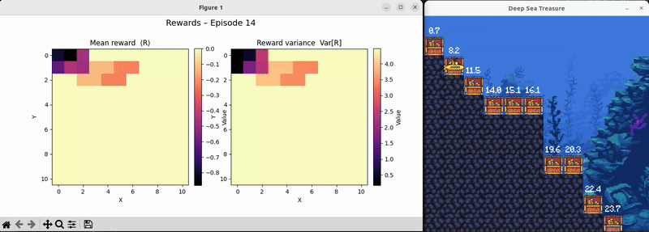
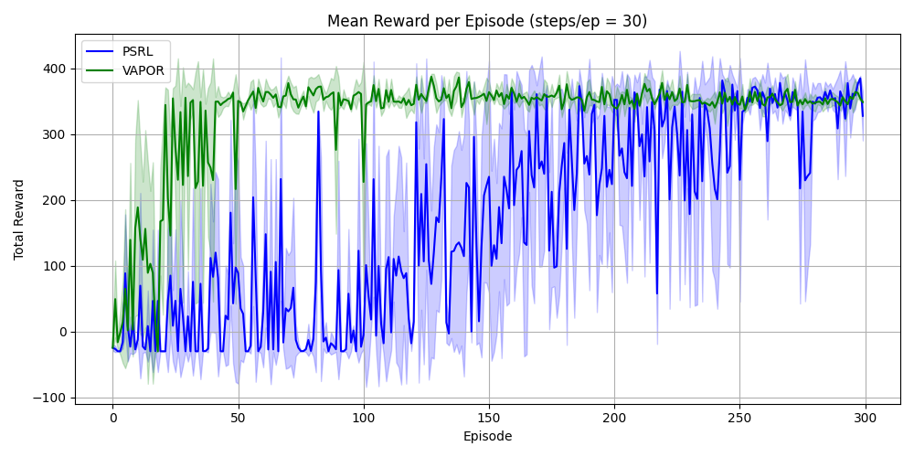
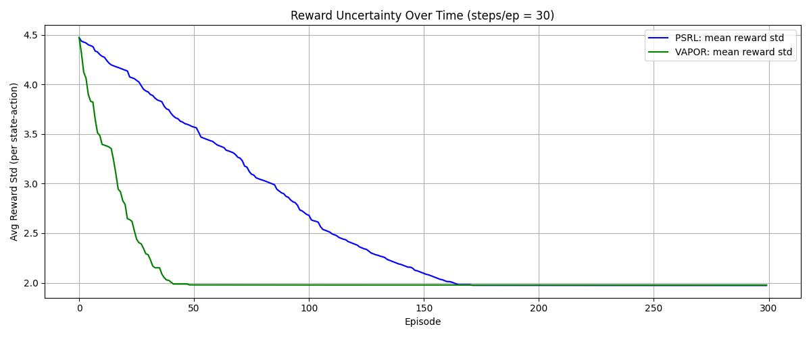

# RL-Explore-Bench

A light-weight playground for **efficient exploration algorithms** in reinforcement learning, centred on an implementation of **VAPOR** (Variational Approximation of Posterior Optimality) from *“Probabilistic Inference in Reinforcement Learning Done Right”* and a reference baseline of **Posterior Sampling RL (PSRL)**. This repository provides an unofficial implementation of the VAPOR algorithm.

| VAPOR in action | Average episodic return | Posterior reward uncertainty |
| :--: | :--: | :--: |
|  |  |  |

---

## 📂  Repository layout

```
rl-explore-bench/
│
├─ algorithms/          # VAPOR & PSRL implementations
│   ├─ vapor.py
│   └─ psrl.py
│
├─ assets/              # GIF + figures used in the README
├─ configs/             # Parameters for running experiments
│
├─ envs/                # Deep-Sea environment
│   ├─ grid_utils.py
│   └─ wrappers.py
│
├─ planning/            # Value-iteration & VAPOR solver
├─ sampling/            # Posterior samplers / distributions
├─ examples/            # Demo
│   └─ deep_sea_demo.py
└─ utils                # utilties for visualisation
```

---

## ⚡  Installation

> **Prerequisites** – Linux/macOS, Python ≥ 3.9.

```bash
# Clone the repository
git clone https://github.com/vkashyap10/rl-explore-bench.git
cd rl-explore-bench

# Create a conda environment with Python ≥ 3.11
conda create -n rl-explore-bench python=3.11 -y
conda activate rl-explore-bench

# Install dependencies
pip install -U pip wheel
pip install -e .                   # installs cvxpy, numpy, matplotlib, tqdm, ruff …

```

---

## 🚀  Quick start

Run the comparison between VAPOR and PSRL on the Deep-Sea environment (default: 30-time steps per episode, 100 episodes):

```bash
python grid_world/examples/deep_sea_demo.py

```

---

## 📖 References

VAPOR
```bibtex
@misc{tarbouriech2023probabilisticinferencereinforcementlearning,
      title={Probabilistic Inference in Reinforcement Learning Done Right}, 
      author={Jean Tarbouriech and Tor Lattimore and Brendan O'Donoghue},
      year={2023},
      eprint={2311.13294},
      archivePrefix={arXiv},
      primaryClass={cs.LG},
      url={https://arxiv.org/abs/2311.13294}, 
}
```
Posterior Sampling RL
```bibtex
@misc{osband2013moreefficientreinforcementlearning,
      title={(More) Efficient Reinforcement Learning via Posterior Sampling}, 
      author={Ian Osband and Daniel Russo and Benjamin Van Roy},
      year={2013},
      eprint={1306.0940},
      archivePrefix={arXiv},
      primaryClass={stat.ML},
      url={https://arxiv.org/abs/1306.0940}, 
}
```
---
